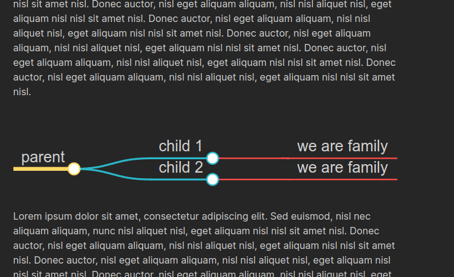
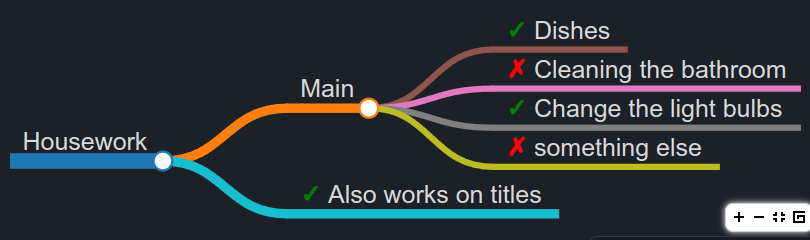
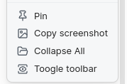

# Obsidian Mind Map


 

This repository contains a plugin for [Obsidian](https://obsidian.md/) for viewing Markdown notes as Mind Maps using [Markmap](https://markmap.js.org/).

A similar plugin is available for [Visual Studio Code](https://marketplace.visualstudio.com/items?itemName=gera2ld.markmap-vscode).

## Features

- [x] Preview your current note as a Mind Map
- [x] **Markmap.js is totally up to date with the [original project](https://markmap.js.org)**
- [x] **Inline markmap preview!**
- [x] Mind Map preview updates
   * as you select other panes, similar to the [Local Graph](https://forum.obsidian.md/t/how-to-open-a-local-graph-view-pane-on-the-right-sidebar/7190), [Outline](https://publish.obsidian.md/help/Plugins/Outline) and [Backlink](https://publish.obsidian.md/help/Plugins/Backlinks) panes
   * as you change settings
   * as you change your file content
   * as you resize the windows or anything related to layout
   * as you open the markdown on another page
- [x] Accepts custom and Markmap.js default frontmatter options
- [x] Copy preview to clipboard as PNG image
- [x] Implements Katex (LaTex plugin)
- [x] Implements checkmarks (such as this list)
- [x] Has branch coloring branch and depth coloring branch approaches
- [x] Avoids XSS injection.

#### Below an preview image with the default content of the official [markmap website](https://markmap.js.org/repl) try it out. Just with the `maxWidth` option.


#### And below an inline markmap preview.



#### This plugin is highly customizable, as you can see in settings.


## Usage

You can open the Mind Map preview for the current note with a command.


### Frontmatter

The plugin also accepts frontmatter options (each of the [official markmap docs](https://markmap.js.org/docs/json-options) except for `extraJs` and `extraCss`). Frontmatter options has higher priority than the settings from the settings tab which means that if you set `maxWidth` on settings to 400px and on frontmatter to 200px, the maxWidth will be set to 200px.

The colors you list will always be used, no matter which coloring approach is set. Only colorFreezeLevel that only works with branch coloring approach. It is good to note that when using branch coloring approach and no color is listed, random colors will be used (as the default Markmap approach).

It is also good to note that the frontmatter only works for that markdown it is in. If you open another Markdown file without frontmatter, the settings from settings tab will be used.

More than the default frontmatter options, it also supports another options (and may be upcomming more options):

**screenshotTextColor:** Set the text color of the screenshot. It accepts any valid CSS color (hex, color name, rgb, rgba and hsl). This color is applied to screenshots only, and not while using the plugin.

**highlight:** A boolean option that allows you to activate a border and a different background color for the inline markmap. If the frontmatter setting is present, it will have higher priority than the settings tab.

### Inline Markmap

You can also use the inline markmap syntax to create a mindmap in your note. You must create a ` ```markmap ` code
block. As an example, the following code:

````markdown
```markmap
# parent

## child 1

- we are family

## child 2

- we are family
```
````

will generate the following mindmap:


#### Highlighting markmap

You can also activate a border and a different background color for the markmap when rendering inline. To do this, you must add the `highlight` option to the frontmatter code with values `true` or `false`, and you can also use the settings tab. And as always, if frontmatter is present, it will have higher priority than the settings tab.

File example:

```markdown
---
markmap:
   highlight: true
---

# Parent

## Child 1

## Child 2

```
### Toolbar

It also has a toolbar that can zoom in, zoom out, reset view and toggle the descendants of the selected node. The toolbar can also be toggled on and off, just click on more options and click on "toggle toolbar".

### Rendering checkboxes

This plugin can also render and display checkboxes, which can be the default lists or also headings. Below and markdown example:

```
---
markmap:
  screenshotTextColor: red
  highlight: false
---


# Housework

## Main

- [x] Dishes
- [ ] Cleaning the bathroom
- [x] Change the light bulbs
- [ ] something else

## [x] Also works on titles
```

And below an result example:



### Notes

Once you run the plugin using Ctrl+P and opening the MindMap, you can't open it again. It changes its content if you change the file you are working on, so that you can work on multiple files and check any of them easily. If you desire, you can close the preview and open it again later.

### Preview More Options Menu

The Mind Map Preview view has 4 options from the "more options" menu:



#### Pin

Allows you to pin the Mind Map preview pane to the current note so that you can select other notes with the current Mind Map remaining in place. A pin icon will appear in the header of the Mind Map preview pane. Click the pin icon to unpin.

#### Copy screenshot

Places a copy of the Mind Map SVG on your clipboard allowing you to paste it into a note in Obsidian or into an image editor of your choice. About the background and foreground colors you have three options:

1. Set the background as transparent, then the foreground color will be the default;
2. Select a background color;
3. Set the background and foreground colors to be as the current theme. So that the screenshot will look the same as show the plugin is displayed.

#### Collapse all

Hides all nodes except the root.

## Compatibility

The obsidian version I have tested is **v1.0.3**, which is recommended to use at least version **v1.0.0**.

## Installing

As of now this plugin is not registered in Obsidian Community Plugins, but it has been published and is awaiting approval. So the only way to do it is by building nightly releases. Go to [nightly installation](#nightly-installation) section.

## Manual installation

1. Download the [latest release](https://github.com/MasterTuto/obsidian-mindmap-vb/releases/latest)
2. Extract the obsidian-mindmap-nextgen folder from the zip to your vault's plugins folder: `<vault>/.obsidian/plugins/`  
   Note: On some machines the `.obsidian` folder may be hidden. On MacOS you should be able to press `Command+Shift+Dot` to show the folder in Finder.
3. Reload Obsidian
4. If prompted about Safe Mode, you can disable safe mode and enable the plugin.

## Nightly Installation

Before anything you will need the following tools installed on your machine:
* [NodeJS](https://nodejs.org/en/)
* NPM (comes with NodeJS)
* Git (optional)

1. Open obsidian
2. Go to `Settings` > `Community plugins`.
3. On `Installed plugins` you can find a folder icon in the end, click on it:


4. Keep this folder open.
5. You can directly click [HERE](https://github.com/AdrianSimionov/obsidian-mindmap-nextgen/archive/refs/heads/main.zip) to download the zip file. Or you can go to [this repo](https://github.com/AdrianSimionov/obsidian-mindmap-nextgen/) and click on the green icon "CODE" and then "Download ZIP".
6. Go to your Downloads folder, or wherever you have downloaded it.
7. Extract the zip file.
8. Copy the extracted folder to the folder you have open on step 3.
9. Go to that extracted folder and open it on terminal (On Windows you can `Shift + Right Click` and then "Open Command Prompt Here" or "Open Powershell Here", and on Linux just `Right Click` and click on "Open terminal here").
10. Run `npm install`.
11. Run `npm run dev`.
12. Go to `Settings` > `Community plugins` on Obsidian.
13. Reload the plugins folder, and then enable "Mind Map NextGen"

## For developers

Pull requests and issues are both welcome and appreciated. 😀

If you would like to contribute to the development of this plugin, please follow the guidelines provided in [CONTRIBUTING.md](CONTRIBUTING.md).
